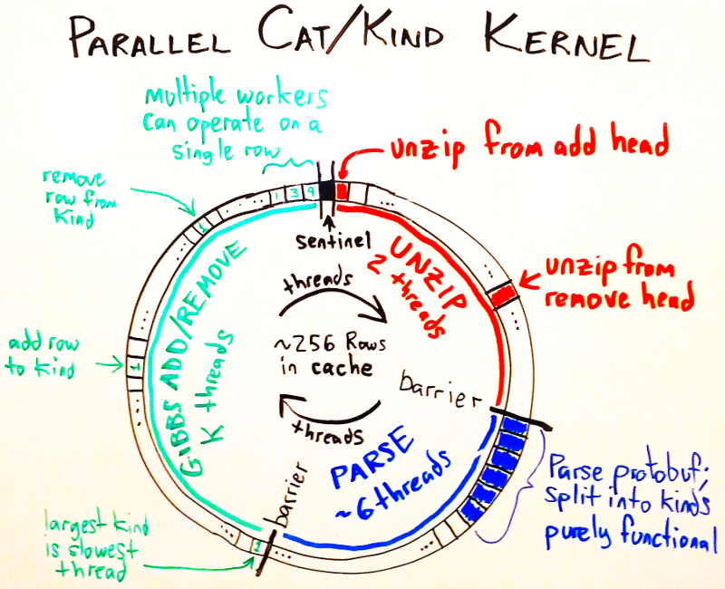

# Adapting and Extending Loom

* [Probabilistic Model](#model)
* [Inference Algorithm](#inference)
* [Sparse Data](#sparsity)
* [Component Architecture](#components)
* [Data Files](#files)
* [Dataflow](#dataflow)
* [Parallelization](#parallel)
* [Developer Tools](#tools)

## Loom's Model: Cross Cat <a name="model"/>

See \cite{mansinghka2009cross, shafto2011probabilistic}.

## Loom's Inference Algorithm <a name="inference"/>

Loom uses subsample-annealed MCMC to infer a cross-categorization.
Specifically, loom interleaves 5 different inference kernels to learn:

* categorization of row into groups, within each kind
* categorization of features in to kinds
* feature hyperparameters
* "clustering" hyperparameters for the Pitman-Yor categorization of rows
* "topology" hyperparameters for the Pitman-Yor categorization of features

We describe each inference kernel in detail.

### Category inference

Single-site Gibbs sampling.

### Kind inference

Block Algorithm 8.

### Hyperparameter inference

Coordinate-wise Grid Gibbs for most models.

Auxiliary kernel for Dirichlet-Process-Discrete.

### Subsample Annealing

Loom uses subsample annealing to improve mixing with large datasets.
Subsample annealing is much like single-site Gibbs sampling,
but progressively adds data while doing single-site Gibbs sampling on its
current subsample of data.

## Sparse Data <a name="sparsity"/>

Loom efficiently handles two types of sparsity in data:

1. Sparsely observed data, e.g., missing fields in forms
2. Sparsely nonzero data, when a column takes a single value most of the time.
   (for boolean/categorical/count valued data, but not real-valued)

### Sparsely Observed Data

Sparsely observed data is handled by ingesting csv data into streams of packed
`ProductValue` protobuf messages.
During inference, loom only looks at the observed columns when computing scores
and updating sufficient statistics.

See [`loom.format.import_rows`](/loom/format.py)
and [`loom.format.export_rows`](/loom/format.py) for implementation.

### Sparsely Nonzero Data

Sparsely nonzero data is handled in by diffing rows against one or more
<b>tare rows</b>, resulting in `ProductValue.Diff` protobuf data structures.
During inference, loom only looks at the diff when scoring and updating
the kind kernel's sufficient statistics, but must look a all tare rows when
updating the cat kernel's sufficient statistics.

The typical application for tare rows is when text fields are blown out to
a large number of boolean present/absent fields, so that most words are missing from most text fields.
Loom has full support for the case when there is a single text field,
or when there are multiple text fields that are always observed; in these cases
a single tare row suffices.
Multiple tare rows are required in the more complicated setting of multiple
text fields which are independently observed (e.g. text field `A` is present
and `B` missing in row `, but `A` is absent and `B` present in row 2, and both
present in row 3).

Loom automatically searches for a single tare row and diffs the data as part of `loom.tasks.ingest`
These two initial passes over the dataset are implemented as
`loom.runner.tare` and loom.runner.sparsify`, resp.
See [differ.hpp](/src/differ.hpp),[.cc](/src/differ.cc) for implementation.

The loom inference engine fully supports multiple tare rows, even though
the automatic `tare` process can only produce a single tare row.
In this case, you can create the tare rows and sparsify with a custom script.

## Component Architecture <a name="components"/>

Loom is organized as a collection of high-level python modules
wrapping a collection of C++ stand-alone utilities.

Within C++, the lowest-level data structures are mostly provided by
protocol buffers in [schema.proto](/src/schema.proto) (
notably `ProductValue`, `ProductValue::Diff`, and `Row`),
or by `Mixture` objects from the
[distributions](https://github.com/forcedotcom/distributions) library.
On top of these basic structures, loom builds `ProductModel` and `ProductMixture` data structures for Dirichlet Process inference.
The `CrossCat` structure holds a factorized collection of `ProductModel`,`ProductMixture` pairs, one pair per kind.
Finally, the `Loom` object wraps a `CrossCat` object for hyperparameters and sufficient statistics, plus an `Assignments` object for row-category assignments.
During kind inference, the kind kernel builds a `KindProposer` object
that has a collection of ephemeral kinds for the block algorithm 8 kind kernel;
the `KindProposer` is analogous to the `CrossCat` object,
but with different caching strategies and with all kinds seeing all features.

The python-C++ binding layer is in [runner.py](/loom/runner.py)
where the top-level C++ executables are run via python subprocess.
In particular, loom does not use extensions/boost::python/cython to bind C++.

## Dataflow <a name="dataflow"/>

When debugging dataflow issues, it is handy to be able to look at files.
Loom provides a `cat` command that tries to decompress + parse + prettyprint
files based on their filename

    python -m loom cat <filename>   # pretty prints file

## Parallelization <a name="parallelization"/>

Loom uses four techniques for parallelization:

1.  Parallelizing inference per-sample using python multiprocessing.
    `loom.tasks.infer` parallelizes inference tasks over
    multiple inference processes.
    In distribututed systems, `loom.tasks.infer_one` can be run per-machine.
    You can configure the number of workers with the `LOOM_THREADS`
    environment variable.
    See `parallel_map` [util.py](/loom/util.py) for the abstraction and
    [tasks.py](/loom/tasks.py) for usage.

2.  Parallelizing hyperparameter kernels per-feature using openmp.
    You can configure this with `config.kernels.hyper.parallel`.
    See `HyperKernel::run` in
    [hyperkernel.cc](/src/hyper_kernel.cc) for implementation.

3.  Parallelizing the kind and category kernels
    using a shared concurrent partially-lock-free ring buffer.
    See the [inference section](#inference) above for details.
    See `Pipeline` in [pipeline.hpp](/src/pipeline.hpp) for the abstraction and
    [cat_pipeline.hpp](/src/cat_pipeline.hpp)|[.cc](/src/cat_pipeline.cc) and
    [kind_pipeline.hpp](/src/kind_pipeline.hpp)|[.cc](/src/kind_pipeline.cc)
    for usage.

4.  Vectorizing low-level math using SIMD operations.
    This is outsourced to the
    [distributions](https://github.com/forcedotcom/distributions) library.

In addition, loom uses openmp to parallelize other simple operations like
loading files and precomputing computation caches.

## Developer Tools <a name="tools"/>

### Debugging

You can inspect any of these files with

    python -m loom cat FILENAME

And watch log files with

    python -m loom watch /path/to/infer_log.pbs

### Testing

The simplest unit tests are accessible by

    make test
    make small-test  # equivalent to make test
    make big-test

These use `loom.datasets` to create synthetic datsets.
Each synthetic datset is accessible from the decorator
`loom.test.util.for_each_dataset`.

When hacking on inference kernels, posterior enumeration tests are much more
sensitive (and expensive). To see available tests, run

    python -m loom.test.posterior_enum

### Profiling, Benchmarking, and Debugging

Each of the high-level C++ executables is wrapped in a benchmarking jig.
To see available jigs, run

    python -m loom.benchmark

These are useful for debugging (set debug=true profile=none),
benchmarking (set debug=false profile=time) and profiling
(e.g. set debug=true profile=callgrind).
To see a list of pre-wrapped profilers, run

    python -m loom.benchmark profilers

The benchmark jigs each take a dataset name.
For debugging, small datasets work well, but for benchmarking, we recommend
using larger datasets or your own datasets.
Each jig depends on previous data, so, e.g.,
to profile inference with your own dataset, you'll need to

    python -m loom.datasets load my-data my-schema.json my-rows.csv
    python -m loom.benchmark ingest my-data
    python -m loom.benchmark tare my-data
    python -m loom.benchmark sparsify my-data
    python -m loom.benchmark init my-data
    python -m loom.benchmark shuffle my-data
    python -m loom.benchmark infer my-data profile=time  # to get a rough idea
    python -m loom.benchmark init-checkpoint my-data
    python -m loom.benchmark infer-checkpoint my-data profile=callgrind
    kcachegrind callgrind.out &  # to view profiling results
